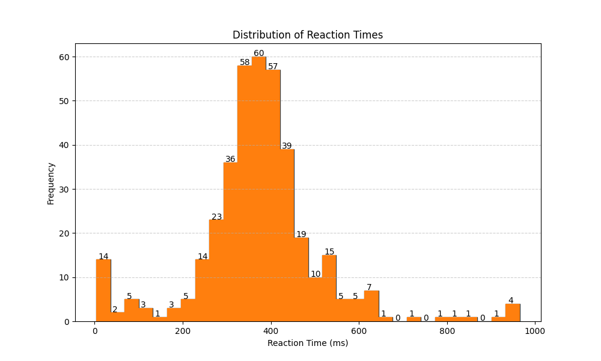

<!--
Color palette
#FF7F0E
#FFFFFF
-->

<div align="center">
  
</div>

---
> [!Important]
> This application was developed over 2 days and then deployed for 5 days for Unit 4 Specialist Mathematics SAC (School Assessed Coursework).
>

# Overview


A simple `Flask` and `sqlite3` application to collect human reaction time data with built-in live comparison against your normal distribution and collected sample distribution.

> [!Important]
> Thank you to the `52 Participants` who took part in the survey over `5 days`, generating `391` datapoints. Your contributions are greatly appreciated.
>
> The raw dataset is available [here (last updated 2025/09/07)](/dataset/reaction.sql)

> [!note]
> - Personal reaction time distribution with mean, standard deviation, and trial count
> - Comparison to the collected sample distribution within the set
> - Percentile ranking against the global distribution

## Data Analysis

According to (Human Benchmark, 2007) the median reaction time is `273 ms` across their dataset. According to their `about the test` section, computer differences and latency can add as much as `150 ms`.

The standard deviation was calculated to be `140.92 ms` while the median was calculated to be `373 ms` across the `391` datapoints with `52` unique users. The range was `961 ms` with a minimum of `4 ms` and maximum of `965 ms` with the test boundaries being `0 ms` to `1000 ms`.

Interestingly, the difference between the `Human Benchmark` dataset and this dataset is `100 ms`, which may indicate a systematic bias introduced by the `CSS` transition applied during the visual stimulus

```css
transition: background-color 0.3s, transform 0.2s;
```

> [!note]
> This line (49) has been commented out. Create a new `sqlite3` database for future studies, as data collected before `2025/10/23` may contain a systematic measurement bias.
## Installation

```
pip install -r requirements.txt
python app.py
```

Then open http://127.0.0.1:8000 in your browser

## References

1. Human Benchmark. (2007). Reaction Time Test. Humanbenchmark.com; Human Benchmark. https://humanbenchmark.com/tests/reactiontime

‌